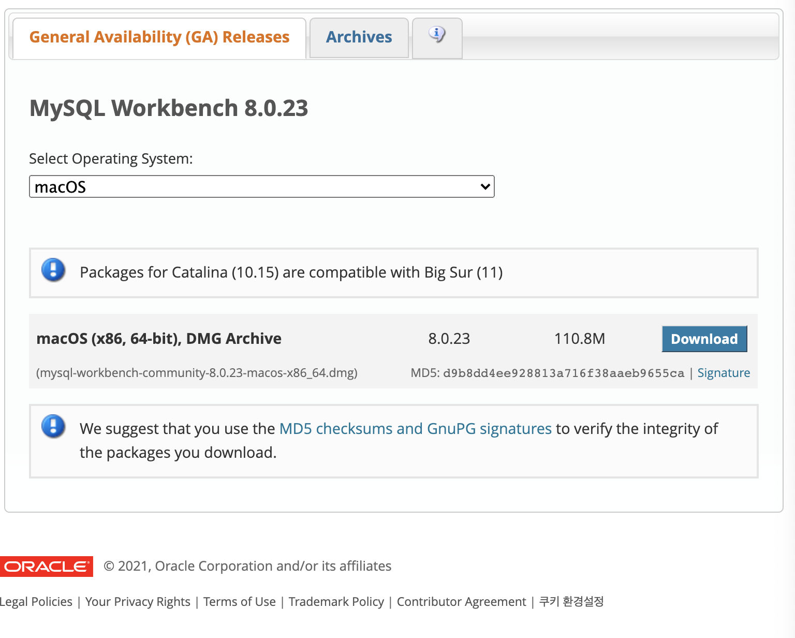

## docker의 mysql과 workbench 연동

이전 1에서 docker와 mysql을 전부 설치한 이후

#### 1. mysql workbench 다운로드
https://dev.mysql.com/downloads/workbench/

#### 2. 워크 벤치 설치 후 + 버튼 클릭

#### 3. mysql에서 설정한 비밀 번호 및 docker에서 설정한 서버 이름 입력
- Connection Name을 docker에서 설정한 mysql 이름과 동일하게 입력
- Password > Store in Keychain 클릭 하여 docker mysql에서 설정한 비밀번호 입력
- OK 클릭

