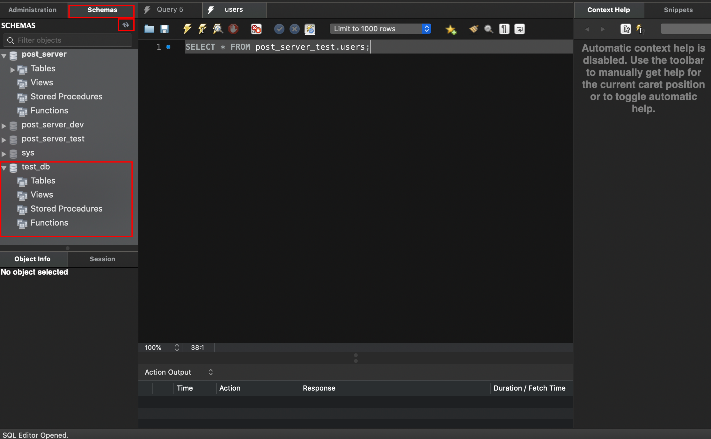

## mysql 명령어로 데이터 베이스 만들기

#### 1. docker를 통해 mysql 접속
```
$ docker exec -it {user}-mysql bash
```
```
root@38dj3jsd8:/# mysql -u root -p
mysql>
```

#### 2. database 보기
```
mysql> show databases;
+--------------------+
| Database           |
+--------------------+
| information_schema |
| mysql              |
| performance_schema |
| post_server        |
| post_server_dev    |
| post_server_test   |
| sys                |
+--------------------+
```

#### 3. database 만들기
```
mysql> create database test_db default character set utf8;
또는
mysql> CREATE DATABASE test_db default CHARACTER SET UTF8;
```
- test_db 데이터 베이스 생성, 한글을 사용할 수 있는 UTF8 문자열을 저장
```
+--------------------+
| Database           |
+--------------------+
| information_schema |
| mysql              |
| performance_schema |
| post_server        |
| post_server_dev    |
| post_server_test   |
| sys                |
| test_db            | <=== 생성됨
+--------------------+
```

#### 4. workbench 에서 데이터베이스 생성 여부 확인
- user-mysql 더블클릭 후 좌측 상단의 Schemas클릭 하여 새로고침 하면 됨


#### 5. sequelize 마이그레이션을 통해 DB에 table 생성하기
```
$ npm run migrate
또는
$ sequelize db:migrate
```

###### sequelize에서 마이그레이션 또는 리셋 중에 특정 마이그레이션 된
###### 파일이 없다는 오류가 나올 때
동일한 이름의 마이그레이션 파일을 생성 후 sequelize를 통해 reset 하면됨.
```js
'use strict';

module.exports = {
  up: function(queryInterface, Sequelize) {
    return Promise.resolve()
  },

  down: function(queryInterface) {
    return Promise.resolve()
  }
}
```